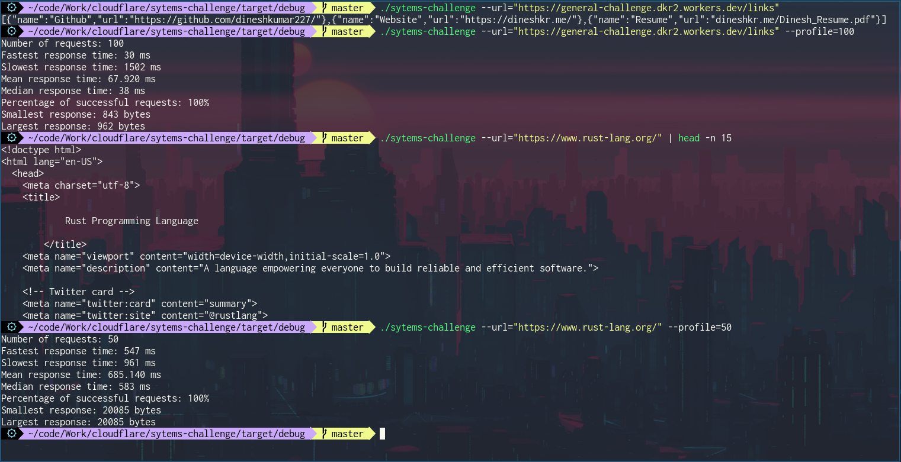
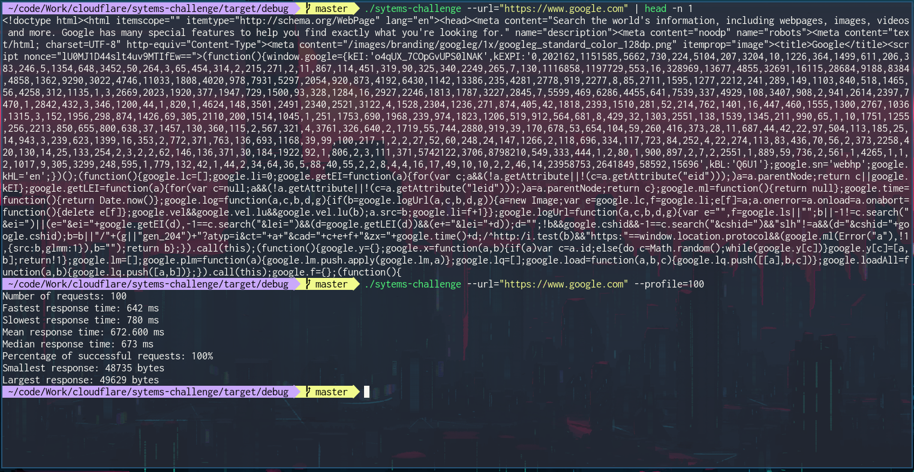
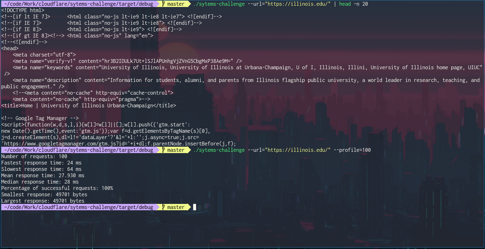
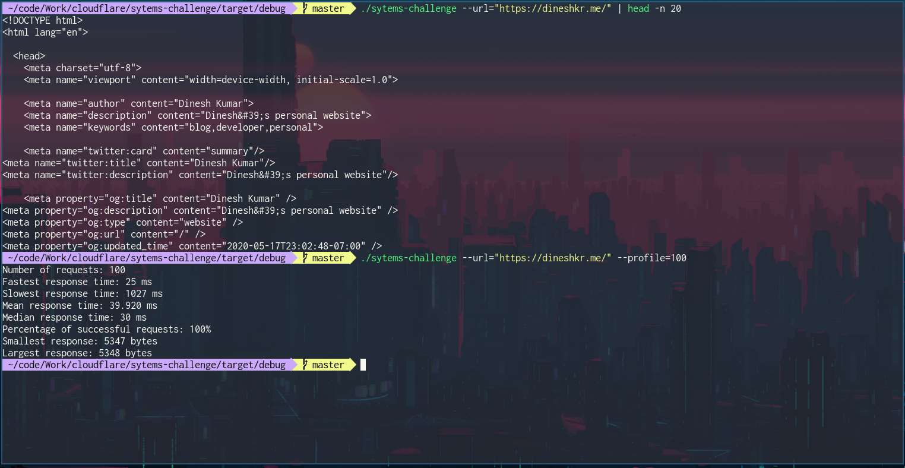
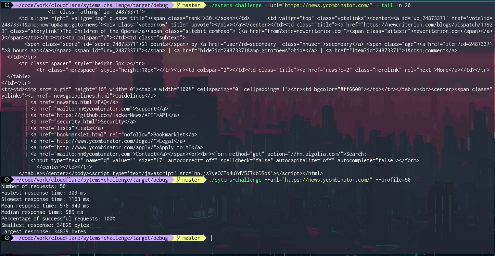
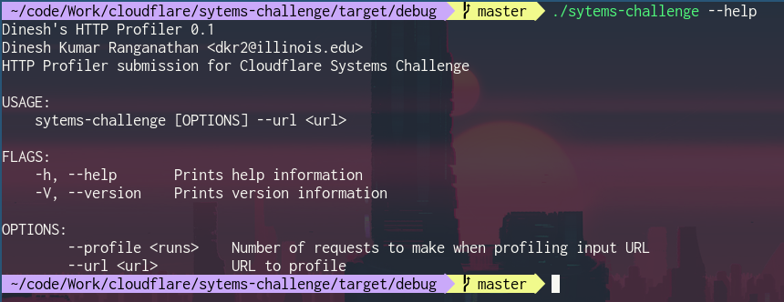

# HTTP Profiler (Cloudflare Systems Challenge Submission)

### Metrics Provided:
* Number of requests
* Fastest time
* Slowest time
* Mean time 
* Median time
* Percentage of successful requests
* Any error codes
* Smallest response size
* Largest response size

## Setup and Installation

* Install [Rust](https://www.rust-lang.org/tools/install)
* `cargo build --release`

## Running Executable

Go to executable:
```
cd target/release/
./sytems-challenge [Args]
```

Or run directly:
```
cargo run -- [Args]
```

### Flags
* `--url=<URL>` The URL that a request will be made to
* `--profile=<NUMBER OF REQUESTS>` Profiles the specified URL <NUMBER OF REQUESTS> times
* `--help` See usage

## Usage

View response to GET request:
```
./sytems-challenge --url=<URL>
```

Profile a site:
```
./sytems-challenge --url=<URL> --profile=<NUMBER OF REQUESTS>
```

## Examples

Profiling general challenge submission (comparison with rust-lang.org):


Google:


UIUC:


My Website:


Hacker News:


Help Page:

